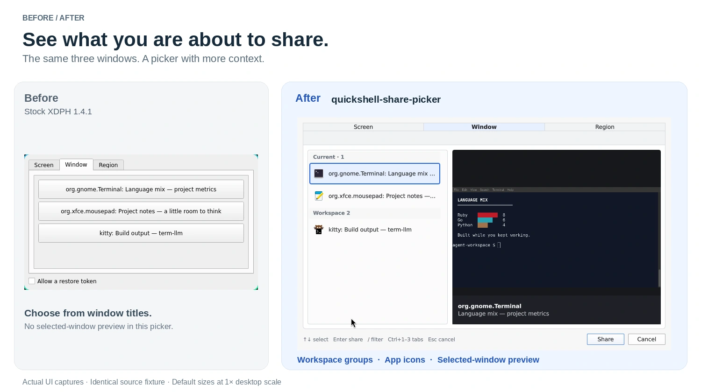
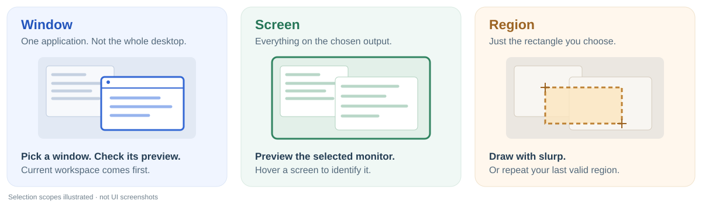

# quickshell-share-picker

**See what you are about to share.** A compact replacement for Hyprland's screen-sharing picker, built with [Quickshell](https://quickshell.org/).

[](docs/assets/before-after.webp)

*Real picker captures, the same three lab windows, and each UI's default size at 1× scale. [Full-size screenshots and capture details](docs/VISUALS.md).*

## What changes

- **Know what you are picking.** Screen and window lists sit beside a selected-source preview, refreshed once per second while the tab is active.
- **Find the right window faster.** Opens on **Window**, puts your current workspace first, and groups the rest by workspace. App icons and `/` filtering help distinguish similar titles.
- **Keep the familiar choices.** Share a screen, a window, or a region selected with `slurp`. A valid previous region can be selected again with **Repeat last region**.



This replaces the **source-selection dialog**, not the portal or the application's sharing controls. Apps continue to use their normal **Share screen** action through [xdg-desktop-portal-hyprland](https://github.com/hyprwm/xdg-desktop-portal-hyprland) (XDPH).

## Install on Arch Linux

The current public release is **v0.2.1**.

Build the bundled, release-pinned package as your normal user:

```sh
sudo pacman -S --needed base-devel git
git clone https://github.com/SamSaffron/quickshell-share-picker.git
cd quickshell-share-picker/aur
makepkg -si
```

Then configure the portal **as your Hyprland desktop user, without `sudo`**:

```sh
quickshell-share-picker-setup install
quickshell-share-picker-setup check
```

Setup preserves unrelated `xdph.conf` settings, backs up the original file before its first change, and refuses to silently replace another configured picker. An interactive install offers to restart XDPH; **restarting interrupts active sharing sessions**.

The v0.2.1 recipe is pinned to its published release archive and checksum. `makepkg -si` installs its package dependencies, including Quickshell, XDPH and `slurp`.

**Runtime:** Hyprland, a compatible XDPH, Quickshell **0.3.1+** with the required Wayland/Hyprland/screencopy support, Python **3.10+**, and GNU coreutils. See [requirements and other install paths](docs/INSTALL.md) for source installs, custom packages, manual portal configuration and removal.

## Pick, preview, share

1. Start sharing from your browser, meeting app, or recorder.
2. Choose **Window**, **Screen**, or **Region**. Select a source and check its preview; Region hands off to `slurp` after the picker closes.
3. Press **Enter** or click **Share**. **Esc** cancels; when filtering, the first Esc clears the filter instead.

| Shortcut | Action |
| --- | --- |
| ↑ / ↓ | Move through sources |
| `/` | Filter windows by title, app or workspace |
| Enter | Share the selected source |
| Ctrl+1 / Ctrl+2 / Ctrl+3 | Screen / Window / Region |
| Esc | Clear the active filter, otherwise cancel |

The default palette is light. Set `QSP_THEME=dark` in the **portal service environment** for dark mode. See [configuration options](docs/INSTALL.md#optional-environment-settings) for the default tab, timeout and icon theme.

## Go deeper

| Guide | What is in it |
| --- | --- |
| [Installation & configuration](docs/INSTALL.md) | Requirements, source and Arch packages, portal setup, environment options, troubleshooting |
| [Architecture & protocol](docs/ARCHITECTURE.md) | How XDPH, the wrapper, Quickshell previews and `slurp` fit together |
| [Development & testing](docs/DEVELOPMENT.md) | Headless checks, real-QML smoke, mock UI and live preview testing |
| [Contributing](CONTRIBUTING.md) | Change guidelines, release automation and AUR publishing |
| [Security](SECURITY.md) | Trust boundaries, private runtime files and reporting issues |

## License

Original code: **MIT**. The selector protocol and interaction model are informed by Sam Saffron's BSD-3-Clause [`better-picker` branch](https://github.com/SamSaffron/xdg-desktop-portal-hyprland/tree/23bda24). See [LICENSE](LICENSE) and [NOTICE](NOTICE) for attribution.
