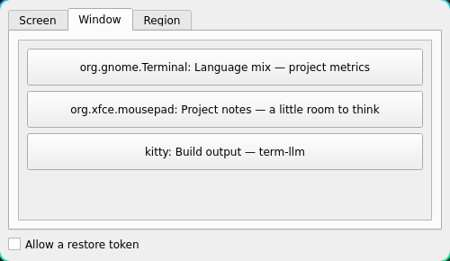
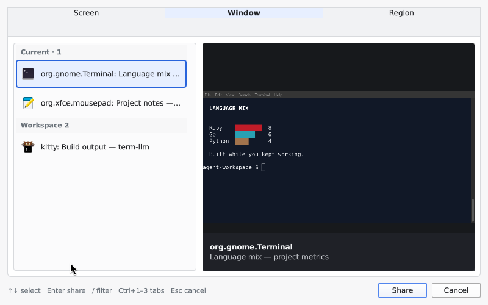

# About the visuals

[Back to the README](../README.md)

## Before / after

These are **actual UI captures**, not recreated dialogs. They compare:

| | Before | After |
| --- | --- | --- |
| Picker | Arch's `hyprland-share-picker`, XDPH **1.4.1-2** | `quickshell-share-picker` checkout [`a51dbde`](https://github.com/SamSaffron/quickshell-share-picker/commit/a51dbdeaa071bf92bb9c2cb50a6a694a350d1d51), including the restore-token opt-in change (`VERSION` 0.2.1) |
| Tab | Window, selected for the comparison | Window, the default |
| Native size | 500 × 290 | 800 × 500 |
| Display | Same 1920 × 1080 output, 1× scale | Same |
| Sources | Same three selector records and real lab windows | Same |
| Restore-token choice | Visible and unchecked (stock default) | Hidden and disabled (new default) |

Neither capture passes `--allow-token` or enables the optional token-selection environment setting. The difference in checkbox visibility is actual default behavior, not image editing. A separate live check confirmed the replacement returns `[SELECTION]/window:1` by default; enabling its optional checkbox and checking it changes the result to `[SELECTION]r/window:1`.

The crops are shown at the **same pixel scale**, preserving both pickers' default sizes. The stock Qt picker uses its light Fusion style; the replacement uses its default light palette. Framing, labels and explanatory captions were added around the screenshots, not inside the controls.

The three sources are a GNOME Terminal containing a small chart, a Mousepad note, and a Kitty console. The first two belong to workspace 1; Kitty belongs to workspace 2. Both pickers received identical, synthetic selector handles and friendly demo titles associated with the actual Hyprland window addresses. The replacement's selected-window preview is a **real capture of that toplevel**, not a supplied thumbnail. Screenshots were taken on September 10, 2026, in a disposable nested Hyprland 0.56.2 / Quickshell 0.3.1 lab.

This is a **picker-UI comparison**, not an end-to-end portal-streaming test, a performance benchmark, or a claim about all stock-picker versions. No production portal settings were changed for these captures.

### Full-size captures

**Stock XDPH:**

**Quickshell replacement:**

## Sharing modes

[`sharing-modes.svg`](assets/sharing-modes.svg) is an original explanatory diagram of selection scope: one window, a whole output, or a region. It is explicitly labelled as an illustration, not a screenshot or a reproduction of the picker UI. Its SVG is editable text and has no external image or font dependencies.
